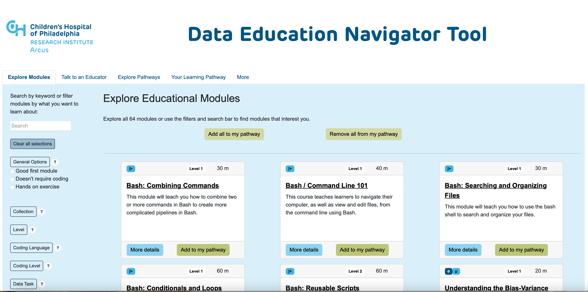

# Module Discovery App

## Overview

The purpose of this app is to allow for easier discovery of the educational modules created as part of the DART program. Ultimately this will replace the current public-facing [list of all modules on the DART website](https://arcus.github.io/education_modules/list_of_modules).

This app will allow users to learn more about each module, investigate how the modules are connected, and search for particular topics or key words and build thier own pathways.

**NOTE:** This is a prototype that is in a phase of rapid development. All effort will be made to keep this README up to date, but some changes might slip by. If something isn't working as expected, please let us know by creating an issue.

## Public prototype

A public prototype of this app is hosted at [https://learn.arcus.chop.edu](https://learn.arcus.chop.edu).



## Development

### File structure

There are several top-level folders:
- `assets` contains the metadata for the educational modules that this app presents.
- `components` contains each of the panels/components of the app, both the visible and the hidden components. Any callbacks that are internal to a component, e.g. expanding and hiding the component or something within the component, is in the component's directory. 
- `callbacks` contains any callbacks that transmit information between different components. All callbacks that update one of the app's hidden components are here.
- `network_analysis` is where the interconnections between modules are processed using the `networkx` package.

Two important python files are also at the top level:
- `app.py` is the python file which runs the app. It contains the visual layout of the components and calls all of the callbacks.
- `module_data.py` is where metadata from the assets folder is processed into a single pandas dataframe for the app to use.

## Testing

Clone or download this repository to run the app yourself!

### Dockerization

The `Dockerfile`, `requirements.txt` are set up to allow this to run in a Docker container on a local computer. To run it, open Docker and a command line interface.

From the top level directory of this repository run:

```
docker build -t module_discovery_app .
```

This may take some a minute the first time you run it. Once it is completed, run:

```
docker run -d -p 8050:8050 module_discovery_app
```

Open a web browser to http://0.0.0.0:8050 to see and interact with the app.

### Running the app locally

If all of the requirements (see `requirements.txt`) are correct on your machine, you can run the app locally without using docker at all with the command:

```
python app.py
```

This will open a port where you can see the app locally. To see error messages, callbacks, and for the app to live update as you develop, set `debug=True` in the last line of `app.py`.

## Data, Automations, and Updates

Data for this application comes from the [Education Modules repository](https://github.com/arcus/education_modules). If changes are made, say a new educational module is created, there are 3 steps to getting that module listed on the application's website, some automated and some manual.

### 1. Processing in education_modules repository (automated GitHub action)

The [Process Module Metadata action](https://github.com/arcus/education_modules/actions/workflows/pull_metadata.yml) is run every time there is a push to the main branch of the education_modules repository.

If any metadata has changed, the action updates the [module_data.json file on the metadata_workflow branch](https://github.com/arcus/education_modules/blob/metadata_workflow/assets/metadata/module_data.json). 

### 2. Bringing data over to module_discovery repository (automated or manual GitHub action)

Once a week the [Update metadata from Education Modules repository action](https://github.com/arcus/module_discovery/actions/workflows/update_module_data.yml) runs and if there has been any change to the `module_data.json` file on in the education_modules repository, the file [`/assets/module_data.json`](https://github.com/arcus/module_discovery/blob/main/assets/education_modules.json) is updated here in the `module_discovery` repository.

Before updating the website at https://learn.arcus.chop.edu it is a good idea to [manually run this action as well using the "Run Workflow" button](https://github.com/arcus/module_discovery/actions/workflows/update_module_data.yml) to ensure that the most recent changes are captured.

### Serving the website (manual process)

Updating the GitHub repository does NOT update https://learn.arcus.chop.edu. Follow the instructions in the [DENT - Module Discovery Operational Manual](https://chop365.sharepoint.com/:w:/r/teams/RSCH-Arcus/Shared%20Documents/Arcus%20Drive/Education/Project_Management/Operational%20Manuals/DENT%20-%20Module%20Discovery%20Operational%20Manual.docx?d=wa1f157c57cb4468f90d12cfe47a762d4&csf=1&web=1&e=MimpjF) to deploy the application.

## Accessibility 

### Goals
This application should be accessible to all users, whether they are accessing the website at https://learn.arcus.chop.edu or examining the documentation and code.

### Documentation
All screenshots should have descriptive alt text.

### Unknowns
This is a Dash/Plotly app which has not yet been tested with any accessibilty technologies. 

### Suggest improvements
If you have needs that are not being met, or ideas for how to test or improve the accessibility of this app, please [create an accessibility issue](https://github.com/arcus/module_discovery/issues/new) so we can work to address it!
