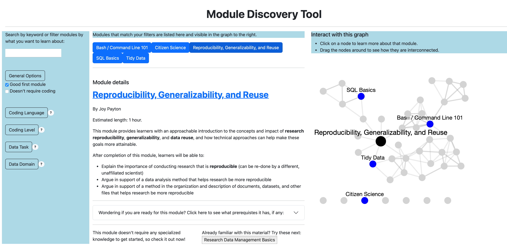

# Module Discovery App

## Overview

The purpose of this app is to allow for easier discovery of the educational modules created as part of the DART program. Ultimately this will replace the current public-facing [list of all modules on the DART website](https://arcus.github.io/education_modules/list_of_modules).

This app will allow users to learn more about each module, investigate how the modules are connected, and search for particular topics or key words.



**NOTE:** This is a prototype that is in a phase of rapid development. All effort will be made to keep this README up to date, but some changes might slip by. If something isn't working as expected, please let us know by creating an issue.


## Development

### Architecture information here 

* Include any javascript or css frameworks you're using e.g. JQuery UI, Bootstrap, Material Design, font families etc.
* Add information about Plotly including a link to documentation
* Add information about Dash including a link to documentation
* Add information about Flask including a link to documentation
* Add information here about dependencies / requirements e.g. version of Python, other software

Consider a diagram that shows the platform "stack"


### File structure

There are three main folders, 
- `assets` for stylesheets and other visual settings, 
- `components` which contains each of the panels/components of the app. Any callbacks that are internal to a component, e.g. expanding and hiding the component or something within the component, is in the component's directory. For example `components/module_details_panel/` contains `module_details_panel.py` as well as `module_details_panelcallbacks.py`, but also smaller sub-components of that panel like the `title_link`, `tags`, and `pre_reqs`.

*Consider adding here a visual map / wireframe of what you mean by module_details and other "components".

- `callbacks` for any callbacks that transmit information between different components. Note that these callbacks will filter through the hidden components of `hidden_active_module` and `hidden_filtered_modules`. In the future there may be a third hidden component (possibly visible) for `my_modules`.

### Module data

The module_data.py file is created from the [education_modules repo](https://github.com/arcus/education_modules/tree/main).

- The [module_data.py](https://github.com/arcus/education_modules/blob/metadata_workflow/assets/metadata/module_data.py) file in the education_modules repository is [automatically updated via a github action](https://github.com/arcus/education_modules/actions/workflows/pull_metadata.yml) every time a change is made to the metadata of any module.
- Once a week [an action runs on this repository](https://github.com/arcus/module_discovery/actions/workflows/update_module_data.yml) to update the module_data.py file here.
- The action in this repository can also be run manually if metadata needs to be updated more frequently.

#### Mini dataset for debugging
There is also a `module_data_mini.py` file that consists of only 5 modules. When developing new features it can be extremely helpful to work out bugs and callbacks on this smaller set of data.

## Testing

Clone or download this repository to run the app yourself!

### Dockerization

The `Dockerfile`, `requirements.txt` are set up to allow this to run in a Docker container on a local computer. To run it, open Docker and a command line interface.

From the top level directory of this repository run:

```
docker build -t module_discovery_app .
```

This may take some a minute the first time you run it. Once it is completed, run:

```
docker run -d -p 8050:8050 module_discovery_app
```

Open a web browser to http://0.0.0.0:8050 to see and interact with the app.

### Running the app locally

If all of the requirements (see `requirements.txt`) are correct on your machine, you can run the app locally without using docker at all with the command:

```
python app.py
```

This will open a port where you can see the app locally. To see error messages, callbacks, and for the app to live update as you develop, set `debug=True` in the last line of `app.py`.

**NOTE:** There will be one error on loading. You can ignore it completely.

## Accessibility 

### Features
All information and relationships represented in the network graphs are also communicated via buttons in the Module Details panel.

### Unknowns
This is a Dash/Plotly app which has not been tested with any accessibility technologies. 

### Suggest improvements
If you have needs that are not being met, or ideas for how to test or improve the accessibility of this app, please [create an accessibility issue](https://github.com/arcus/module_discovery/issues/new) so we can work to address it!
